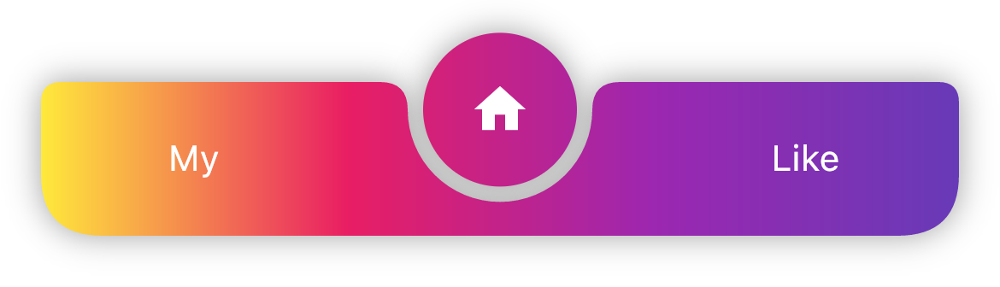
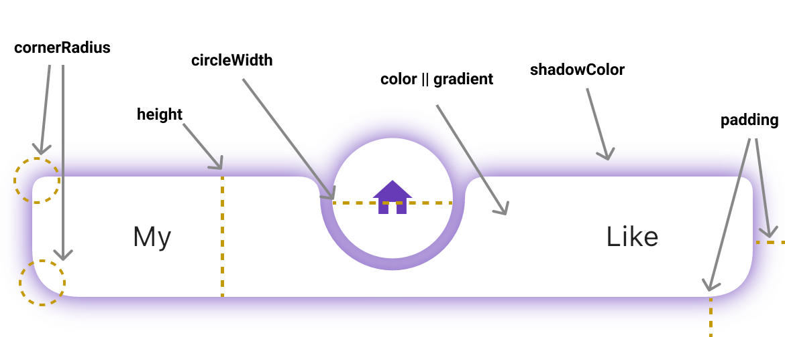

# Circle Bottom Bar


## Example style:

|            **no padding black**             |            **padding with gradient**             | 
| :------------------------------: | :------------------------------: | 
|         |         |  |


## How to use
```yaml
dependencies:
  circle_bottom_bar: ^latest_version
```

```dart
import 'package:circle_bottom_bar/circle_bottom_bar.dart';

Scaffold(
      bottomNavigationBar: CircleBottomBar(
        activeIcons: const [
          Icon(Icons.person, color: Colors.deepPurple),
          Icon(Icons.home, color: Colors.deepPurple),
          Icon(Icons.favorite, color: Colors.deepPurple),
        ],
        inactiveIcons: const [
          Text("My"),
          Text("Home"),
          Text("Like"),
        ],
        color: Colors.white,
        height: 60,
        circleWidth: 60,
        initIndex: 1,
        onChanged: (v) {
          // TODO
        },
        // tabCurve: ,
        padding: const EdgeInsets.only(left: 16, right: 16, bottom: 20),
        cornerRadius: const BorderRadius.only(
          topLeft: Radius.circular(8),
          topRight: Radius.circular(8),
          bottomRight: Radius.circular(24),
          bottomLeft: Radius.circular(24),
        ),
        shadowColor: Colors.deepPurple,
        elevation: 10,
      ),
```

